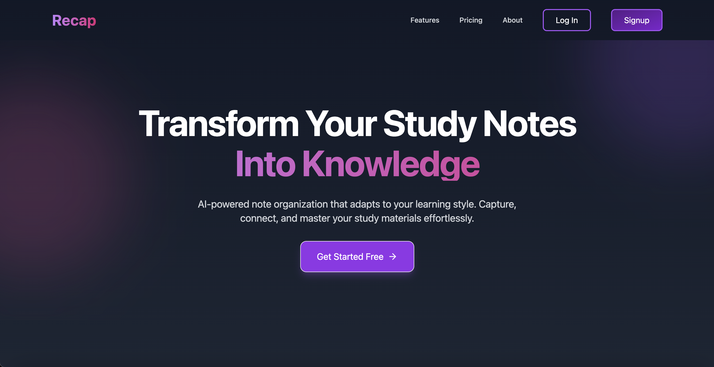
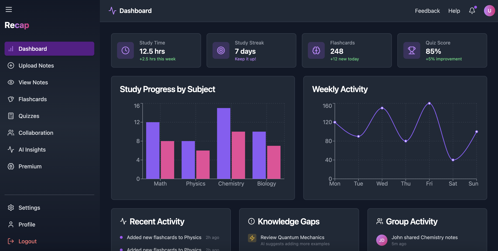
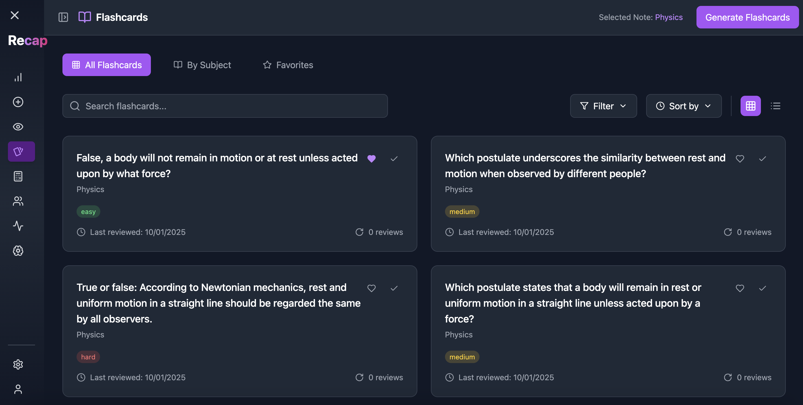
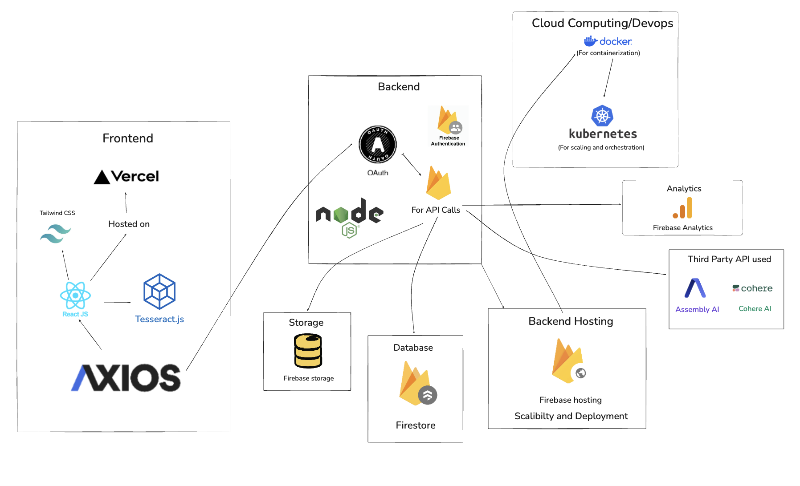

<p align="center">
  
</p>

> AI-powered note organization that adapts to your learning style. Capture, connect, and master your study materials effortlessly.

<p align="center">
  <a href="[https://recap-projectt.vercel.app/](https://recap-5ajg.vercel.app/)" target="_blank">
    
  </a>
</p>

<div align="center">

[](https://github.com/ArshTiwari2004/Recap/issues)
[](https://github.com/ArshTiwari2004/Recap/network)
[](https://github.com/ArshTiwari2004/Recap/stargazers)
[](https://github.com/ArshTiwari2004/Recap/graphs/contributors)
[](LICENSE)


</div>

## 📌 Overview

Recap is an innovative study companion designed to revolutionize how students organize and interact with their study materials. Our platform leverages artificial intelligence to create an intelligent note-taking ecosystem that grows with your learning journey.

### 🌟 Key Features

- **Smart Note Organization**: Automatic categorization by subject and topic
- **View Your Notes**: View all your notes in a organized, customizable way
- **Flashcard Generation**: Automatic creation of study cards from your notes which you can revise later
- **OCR Integration**: Convert handwritten notes to digital text
- **Audio Transcription**: Convert lecture recordings to searchable text
- **Collaborative Learning**: Share and create groups with peers and study
- **AI-Powered Insights**: Identify knowledge gaps and get personalized recommendations and resources
- **Gamified Learning**: Stay motivated with study streaks and interactive quizzes

## 🖼️ Screenshots


*Landing page of Recap*


*Dashboard of RECAP*


*AI-Generated Flashcards in RECAP*

## 🛠️ Tech Stack

### Frontend
|  |  |  |  |  |
|---|---|---|---|---|

### Backend
|  |  |  |  |  |
|---|---|---|---|---|
|  |  |  |  | |

### API Used
|  |  |
|---|---|

### DevOps & Deployment
|  |  |  |  |
|---|---|---|---|


## Architecture of RECAP




## 🚀 Getting Started

### Prerequisites

- Node.js 18.0 or higher
- npm or yarn
- MongoDB account
- AssemblyAI account for the API key

### Installation and Setup

1. Clone the repository
```bash
git clone https://github.com/ArshTiwari2004/Recap.git
```
```bash
cd Recap
```
```bash
cd Recap-frontend
```

2. Install dependencies
```bash
npm install
# or
yarn install
```

3. Set up environment variables
```bash
cp .env.example .env.local
```
Fill in your environment variables in `.env.local`:
```
ASSEMBLY_API_KEY=your_api_key
MONGODB_URI=your_mongodb_uri
...
```

4. Run the development server
```bash
npm run dev
# or
yarn dev
```

5. Open [http://localhost:5173](http://localhost:5173) in your browser

## 📖 Documentation

For detailed documentation, please visit our [Wiki](https://github.com/ArshTiwari2004/Recap/wiki).

## 👥 Team Synapse

Meet the minds behind Recap:

### Arsh Tiwari
[](https://github.com/ArshTiwari2004)
[]([https://www.linkedin.com/in/arsh-tiwari-072609284/)
[]([https://x.com/ArshTiwari17)

### Priyanshi Bothra
[](https://github.com/priyanshi0609)
[](your-linkedin-url)
[](your-twitter-url)

### Nibedan Pati
[](https://github.com/Heisenberg300604)
[](your-linkedin-url)
[](your-twitter-url)

## 🤝 Contributing

We welcome contributions! Please see our [Contributing Guidelines](CONTRIBUTING.md) for details.

1. Fork the repository
2. Create your feature branch (`git checkout -b feature/AmazingFeature`)
3. Commit your changes (`git commit -m 'Add some AmazingFeature'`)
4. Push to the branch (`git push origin feature/AmazingFeature`)
5. Open a Pull Request

## 📄 License

This project is licensed under the MIT License - see the [LICENSE](LICENSE) file for details.


## 📞 Contact

For support or queries, reach out to us at [teamsynapse3@gmail.com](teamsynapse3@gmail.com)

---

<p align="center">Made with ❤️ by Team Synapse</p>
